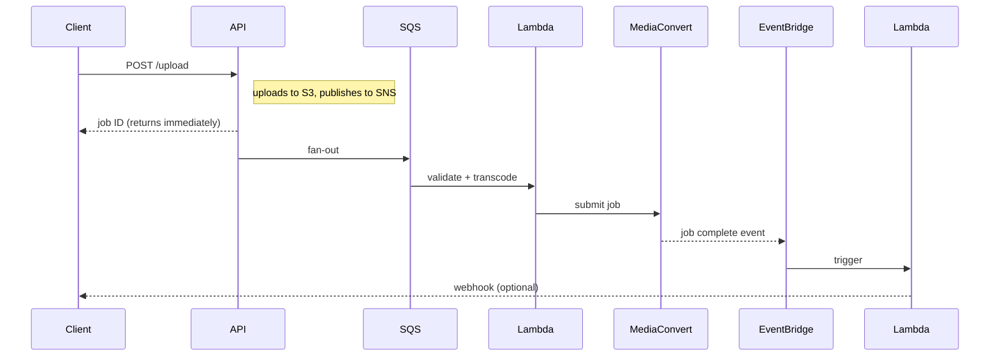

The original flow was synchronous: client uploads a file, the API calls MediaConvert, waits for a response, and returns a job ID. Works fine at low volume. At higher concurrency it falls apart: Lambda timeouts, blocked API threads, and MediaConvert throttling errors that the client has to retry manually.

The goal was to make the flow async without changing the existing API contract. Clients already expected a job ID back immediately. The challenge was wiring up completion events without polling.

## The revised architecture

The API becomes a thin entry point: it validates the upload, puts the file in S3, publishes to SNS, and returns immediately. All the heavy work happens downstream.

## What made this possible without a contract break

The job ID was already being persisted in a DynamoDB table. The API returned it before processing was complete. Clients polled a `GET /jobs/:id` endpoint to check status.

The endpoint, the job IDs, and the client-facing contract stayed the same. What changed was who writes to the status field. Before: the API wrote `completed` after MediaConvert returned. After: an EventBridge rule triggers a Lambda that writes `completed` when MediaConvert emits its completion event.

The client experience is identical. The API just became a lot faster.

## Tradeoffs that were worth it

**Observability got harder.** A synchronous flow fails in one place. An async pipeline can fail in five. Structured logging at each Lambda boundary made it possible to reconstruct processing timelines across asynchronous services. A dead-letter queue dashboard surfaced stuck jobs.

**Local development got harder.** You can't run this on your laptop without mocking SNS, SQS, and EventBridge. LocalStack covers integration tests; unit tests stay focused on the Lambda handlers in isolation.

**Retry logic moved into the infrastructure.** SQS handles retries with configurable backoff. That's one less thing to code, but it also means you need to understand SQS visibility timeouts and what happens when a Lambda crashes mid-process.

## What I'd do differently

The SNS-to-SQS fan-out was added early in anticipation of multiple consumers. A second consumer never materialized. Going straight from S3 events to SQS would have been simpler, and the SNS layer turned out to be unnecessary complexity. The architecture should earn each moving part.
